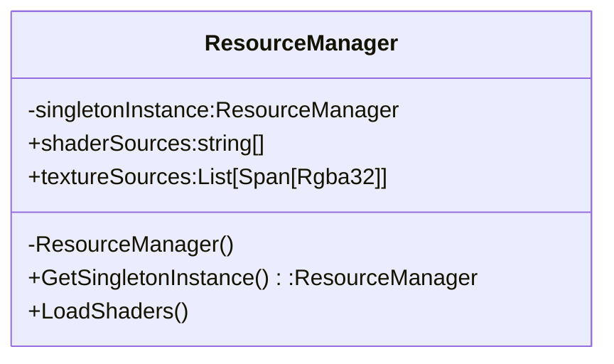

# 类图

## ResourceManager

```mermaid
classDiagram
    class ResourceManager {
        -singletonInstance:ResourceManager
        +shaderSources:string[]
        +textureSources:List[Span[Rgba32]]
        -ResourceManager()
        +GetSingletonInstance():ResourceManager
        +LoadShaders()
    }
```