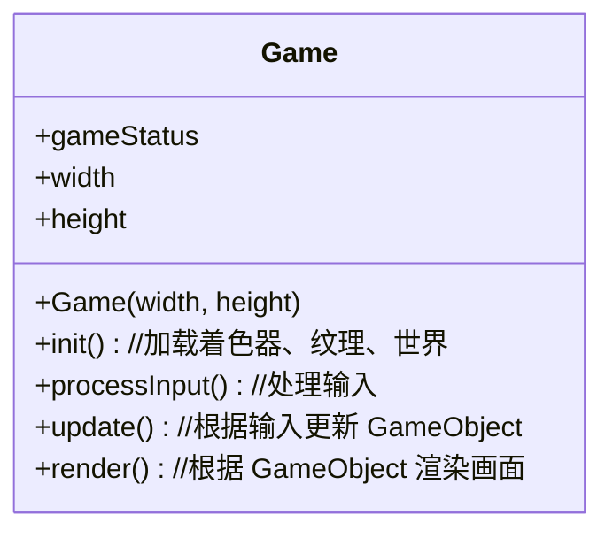
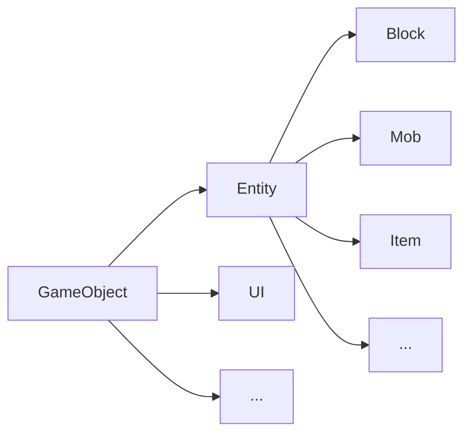

# 初期架构设计

## 主类：Game

“游戏”类是汇总各个模块的地方，负责储存游戏相关变量，处理初始化和游戏循环

看起来应该像这样：

其中：

- `init()` 用于加载着色器、纹理、世界
- `processInput()` 用于处理用户输入
- `update()` 用于根据输入更新 World
- `render()` 用于根据 World 渲染画面

## OpenGL 工具类

将常用的 OpenGL 代码段进行封装，方便复用。

主要包含：

- 着色器类 `class Shader`
- 2D纹理类 `class Texture2D`
- ...

## <del>资源管理器类：ResourceManager</del>
***由于设计调整，不再使用***

## 游戏对象类：GameObject

游戏中所有的对象都属于或派生于该类。

<u>***TODO: 根据游戏内容设计该类及其子类***</u>

目前规划子类：

## 世界类：World

包含所有的游戏对象`gameObjectList`，由`update()`更新，并为`render()`提供信息。依赖于资源管理器类进行存档的读入和写出。